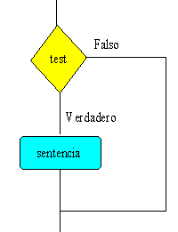
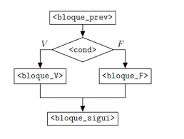
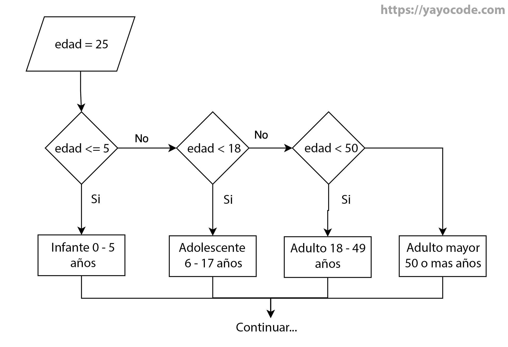
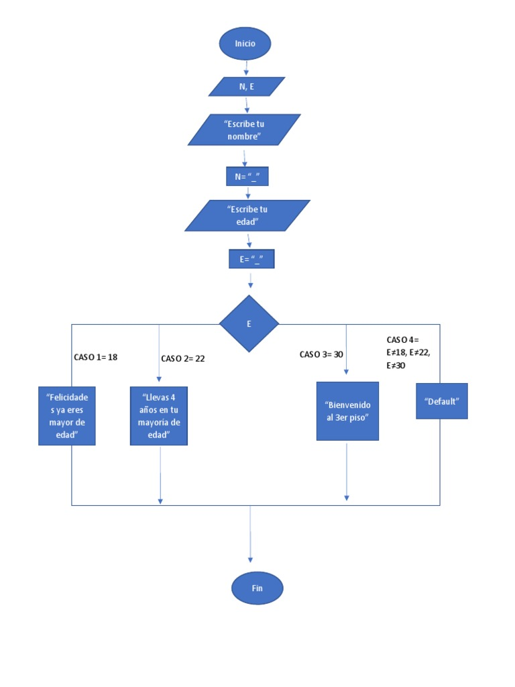
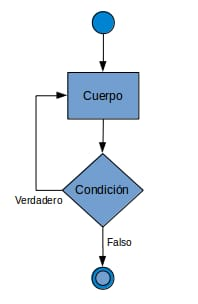
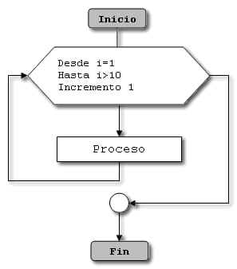
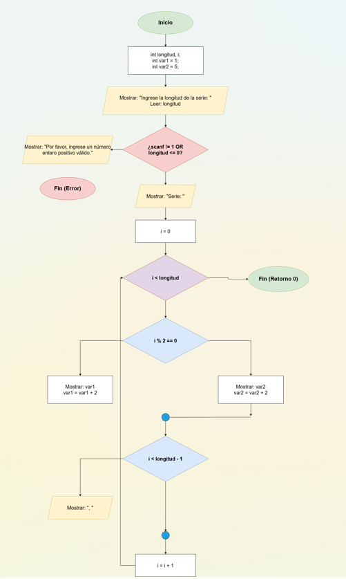

# 📖 Unidad 2 – Estructuras de Control

<div align="center">


</div>

---

## 📝 Contenidos

### 🔹 Estructuras Condicionales

Permiten que un programa tome decisiones y ejecute diferentes bloques de instrucciones según se cumpla o no una condición.

---

#### ▪️ Condicional Simple — `if`

Ejecuta un bloque de instrucciones **solo si** la condición es verdadera.

**Pseudocódigo (PseInt):**
```pseint
Si condicion Entonces
    // instrucciones
FinSi
```

<div align="center">



</div>

---

#### ▪️ Condicional Doble — `if / else`

Ejecuta un bloque si la condición es verdadera, y **otro bloque** si es falsa.

**Pseudocódigo (PseInt):**
```pseint
Si condicion Entonces
    // instrucciones si es verdadero
SiNo
    // instrucciones si es falso
FinSi
```

<div align="center">



</div>

---

#### ▪️ Condicional Múltiple — `if / else if / else`

Evalúa varias condiciones en cadena hasta encontrar una verdadera.

**Pseudocódigo (PseInt):**
```pseint
Si condicion1 Entonces
    // instrucciones
SiNo Si condicion2 Entonces
    // instrucciones
SiNo Si condicion3 Entonces
    // instrucciones
SiNo
    // instrucciones por defecto
FinSi
```

<div align="center">



</div>

---

#### ▪️ Condicional por Casos — `switch`

Compara el valor de una variable con múltiples casos posibles y ejecuta el bloque correspondiente.

**Pseudocódigo (PseInt):**
```pseint
Segun variable Hacer
    caso valor1:
        // instrucciones
    caso valor2:
        // instrucciones
    De Otro Modo:
        // instrucciones por defecto
FinSegun
```

<div align="center">



</div>

---

### 🔹 Estructuras Repetitivas

Permiten ejecutar un bloque de instrucciones múltiples veces mientras se cumpla una condición o durante un número determinado de veces.

---

#### ▪️ Bucle `while` — Mientras

Repite las instrucciones **mientras** la condición sea verdadera. La condición se evalúa **antes** de ejecutar el bloque.

**Pseudocódigo (PseInt):**
```pseint
Mientras condicion Hacer
    // instrucciones
FinMientras
```

<div align="center">



</div>

---

#### ▪️ Bucle `for` — Para

Se usa cuando se conoce de antemano cuántas veces se debe repetir el bloque.

**Pseudocódigo (PseInt):**
```pseint
Para variable <- valorInicial Hasta valorFinal Con Paso incremento Hacer
    // instrucciones
FinPara
```

<div align="center">



</div>

---

#### ▪️ Bucle `do while` — Repetir / Hasta Que

Ejecuta el bloque **al menos una vez** y luego repite **mientras** la condición sea verdadera. La condición se evalúa **después** de ejecutar el bloque.

**Pseudocódigo (PseInt):**
```pseint
Repetir
    // instrucciones
Hasta Que condicion
```

<div align="center">


</div>

---

## 💻 Ejercicio con Estructura Condicional y Repetitiva — Lenguaje C

### 📌 Planteamiento del Problema

Desarrollar un programa en C que genere una **serie numérica intercalada** de longitud definida por el usuario. La serie alterna entre dos secuencias aritméticas: una que comienza en 1 e incrementa de 2 en 2, y otra que comienza en 5 e incrementa de 2 en 2. La secuencia a imprimir en cada posición depende de si el índice es par o impar.

---

### 🔍 Análisis del Problema

| Elemento | Descripción |
|----------|-------------|
| **Entrada** | Longitud de la serie (`longitud`) — número entero positivo |
| **Proceso** | Para cada posición `i` de `0` a `longitud-1`: |
| | Si `i` es par → imprimir `var1` (inicia en 1, incrementa en 2) |
| | Si `i` es impar → imprimir `var2` (inicia en 5, incrementa en 2) |
| | Separar términos con `, ` excepto el último |
| **Salida** | Serie numérica intercalada. Ej. con longitud 6: `1, 5, 3, 7, 5, 9` |

---

### 🗂️ Diseño del Algoritmo

#### Diagrama de Flujo

<div align="center">



</div>

---

### 🖥️ Codificación — Código Fuente en C

> 📄 Archivo: [`codigo/serie.c`](./codigo/serie.c)

```c
#include <stdio.h>

int main() {
    int longitud;
    int var1 = 1;
    int var2 = 5;

    // Solicitar al usuario la cantidad de términos
    printf("Ingrese la longitud de la serie (cantidad de terminos): ");
    if (scanf("%d", &longitud) != 1 || longitud <= 0) {
        printf("Por favor, ingrese un numero entero positivo valido.\n");
        return 1;
    }

    printf("Serie: ");
    for (int i = 0; i < longitud; i++) {
        // Si 'i' es par, imprime var1 y la incrementa
        if (i % 2 == 0) {
            printf("%d", var1);
            var1 += 2;
        } 
        // Si 'i' es impar, imprime var2 y la incrementa
        else {
            printf("%d", var2);
            var2 += 2;
        }

        // Imprime una coma y un espacio entre los números, excepto en el último
        if (i < longitud - 1) {
            printf(", ");
        }
    }

    return 0;
}
```

---

### 🧪 Validación — Prueba de Escritorio

> **Dato de prueba:** `longitud = 6`

| `i` | `i % 2` | Condición | `var1` | `var2` | Imprime |
|:---:|:-------:|-----------|:------:|:------:|---------|
| — | — | Valores iniciales | 1 | 5 | — |
| 0 | 0 | par → imprime `var1` | 1 → 3 | 5 | `1, ` |
| 1 | 1 | impar → imprime `var2` | 3 | 5 → 7 | `5, ` |
| 2 | 0 | par → imprime `var1` | 3 → 5 | 7 | `3, ` |
| 3 | 1 | impar → imprime `var2` | 5 | 7 → 9 | `7, ` |
| 4 | 0 | par → imprime `var1` | 5 → 7 | 9 | `5, ` |
| 5 | 1 | impar → imprime `var2` | 7 | 9 → 11 | `9` |

**Salida esperada:**
```
Ingrese la longitud de la serie (cantidad de terminos): 6
Serie: 1, 5, 3, 7, 5, 9
```

---

## 💬 Principales Dificultades y Reflexión Crítica

Lo que más me costó en esta unidad fue combinar el `do while` con el `for`, porque al principio me confundía en qué parte colocar cada bucle y cuándo usar uno u otro. También me tomó un poco entender la lógica de los `if / else if` encadenados para evaluar el desempeño sin que las condiciones se pisaran entre sí.

En lo académico esto me sirve bastante porque casi cualquier programa real necesita validar datos y repetir procesos, así que son herramientas que se usan todo el tiempo. En lo laboral, la lógica condicional y repetitiva está presente en sistemas de gestión, aplicaciones web y hasta en scripts simples de automatización, por lo que entenderla bien es clave para cualquier área de desarrollo.

---

<div align="center">
<a href="../README.md">⬅️ Volver al inicio</a>
</div>
